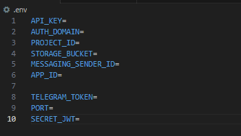

# telegram-bot-api

## Tabela de Conteúdo
- [Overview](#overview)
- [Documentação](#documentação)
  - [Instalação](#instalação)
  - [Rotas](#rotas)
    - [Admin](#admin)
    - [Chat](#chat)

## Overview
Uma API responsável por implementar funções de um bot do telegram, gerenciando as mensagens e os usuários do bot, permitindo enviar mensagens para os usuários do bot e recuperar seus dados em formato JSON. Os dados podem ser recuperados por qualquer cliente capaz de fazer requisições HTTP, onde no caso, eu utilizei uma página web criada com o Framework Vue.js para consumir os dados da API, disponível no repositório a seguir: <a href="https://github.com/mateusmdev/telegram-bot-vue">Telegram Bot Vue.js<a/> </br>

Um resumo do projeto:
<ul>
  <li>Realizar CRUD através das rotas da API (GET, POST, PUT, DELETE)</li>
  <li>Login/Autenticação JWT</li>
  <li>Persistencia no banco de dados</li>
  <li>Utilização de .ENV para ocultação de dados sensíveis</li>
  <li>Upload de imagens</li>
  <li>Migrations para documentação do banco</li>
  <li>Seeds de dados</li>
</ul>

### Ferramentas utilizadas
<ul>
  <li>Javascript</li>
  <li>Node.js</li>
  <li>Express.js</li>
  <li>Firebase (Firestore para armazenamento de dados)</li>
  <li>Telegram API</li>
  <li>Telegraf</li>
  <li>JWT</li>
  <li>BCrypt</li>
  <li>Dotenv (.env)</li>
  <li>NPM (Gerenciador de dependências)</li>
  <li>Nodemon (Auto reload)</li>
</ul>

## Documentação

### Instalação

Após clonar o repositório, faça os passos abaixo para completar a instalação do projeto:

Entre dentro do diretório clonado do projeto e realize os passoa abaixo.

  - ./env.example - Mude o nome do arquivo para .env
    


Abra o arquivo '.env' que estará com os valores vazios. Preenchar as variáveis de ambientes com as suas configurações do Node, Telegram e Firebase. Sem isso o projeto não vai funcionar.

Feito isso, abra o terminal dentro do diretório do projeto e execute o comando abaixo para baixar as dependências necessárias.

```javascript
npm install
```

Execute o comando a seguir para iniciar a API

```javascript
npm start
```
Ou

```javascript
node index.js
```

### Rotas

Rotas existentes para essa API:

#### Admin

| Método| Rota |Descrição|Token JWT|
|------|-------|---------|----------
| POST |`/authentication` | Rota utilizada para realizar login com base nos dados passados no corpo da requisição | Não

#### Chat

| Método| Rota |Descrição|Token JWT|
|------|-------|---------|----------
| GET  |`/chat`| Retorna dados em formato JSON de todos os chat e os dados de seus usuários | Sim |
| POST |`/chat` | Enviar dados através do corpo da requisição e os persiste no banco da dados como um novo produto | Sim |

</br>
